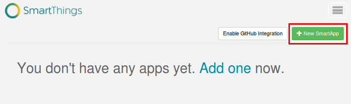
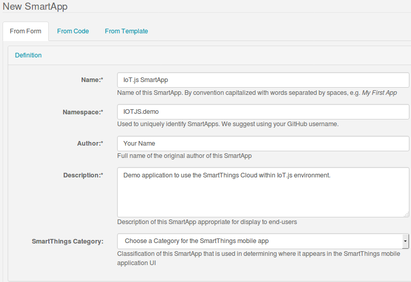
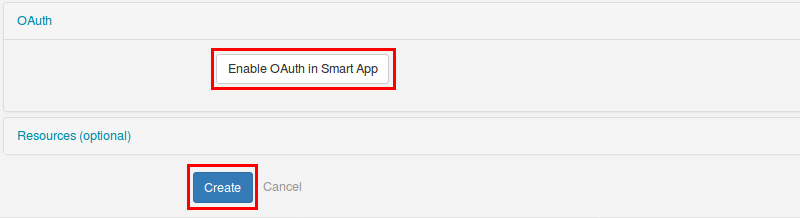
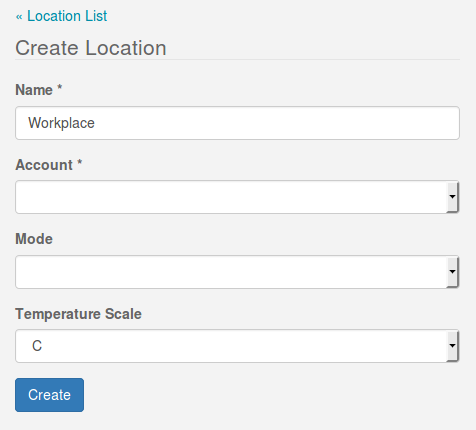
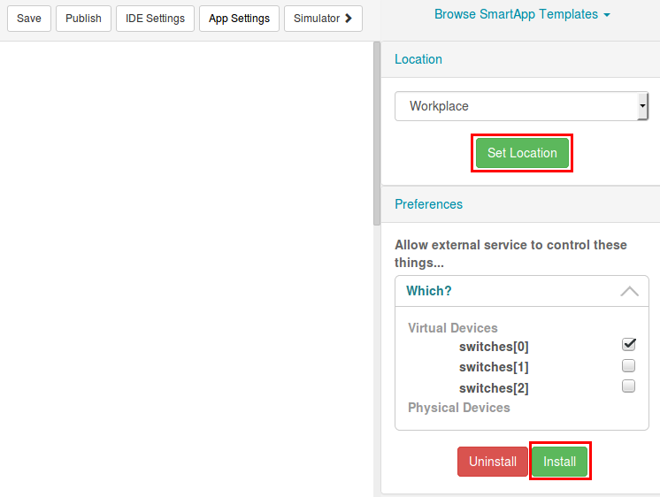
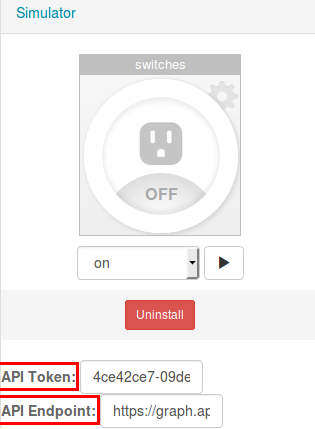
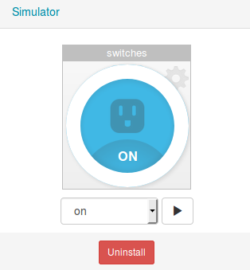

# IoT.js demo application for SmartThings Cloud

The purpose of the project is to use the SmartThings API within IoT.js environment.

### 1. Initialize the SmartThings Cloud

In the first step, create an account at the [Samsung's SmartThings Cloud](https://graph.api.smartthings.com/) webpage. After login, select the `My SmartApps` menu and click to the `new SmartApp` button.



Fill the application creation form and enable the OAUTH authentication (in order to be able to use the Cloud within IoT.js).




After that, click to the `Create` button that will redirect to a code editor. In the editor, there is a pre-defined source code. Remove that code and paste the content of the `smartthings.groovy` file. Finally, click to the `Save` button and publish the application (`Publish` button -> `For Me` option).

#### 1.1 Run the simulator

In the first step, a `Location` must be created that the simulator requires. Select the `My Locations` menu, and create a `Workplace` location.



Go back to the previously created SmartApp (`My SmartApps` menu -> choose the created one). Click to the `simulator` button and run the simulator.




### 2. Initialize the client application

To control the devices in the Cloud's simulator, the API Token and the API Endpoint (from the simulator) should be copied into the `authorization.json` file. In case of the API endpoint, just the ID should be copied (at the end of URI). Need to mention that the API endpoint changes every time you restart simulator.

An example of the authorization.json file:
```json
{
  "api-token": "4ce42ce7-09de-4350-a27e-be7122a354fa",
  "api-endpoint": "f6cf88ec-35cb-41a9-b4d8-dbdd571891af"
}
```

### 3. Build IoT.js with HTTPS module

The communication (client app - smart app) happens over HTTPS. In the first step, install the `libcurl4-gnutls-dev` package because the HTTPS module of IoT.js uses `curl`.

```sh
$ sudo apt-get install libcurl4-gnutls-dev

$ tools/build.py --clean --cmake-param=-DENABLE_MODULE_HTTPS=ON
```

### 4. Run the demo.js file

```sh
# Assuming you are in the iotjs-smartthings-demo folder.

$ /path/to/iotjs demo.js
```

In the simulator, the state of the switch should be changed to `on`:



The ouput of the command should looks like (at client side):
```
[{"name":"switches","value":null}]
```

The value of the switches is `null` because the device (probably) is not initialized. If `demo.js` executed again, the value of the switch should be `on`:
```
[{"name":"switches","value":"on"}]
```
